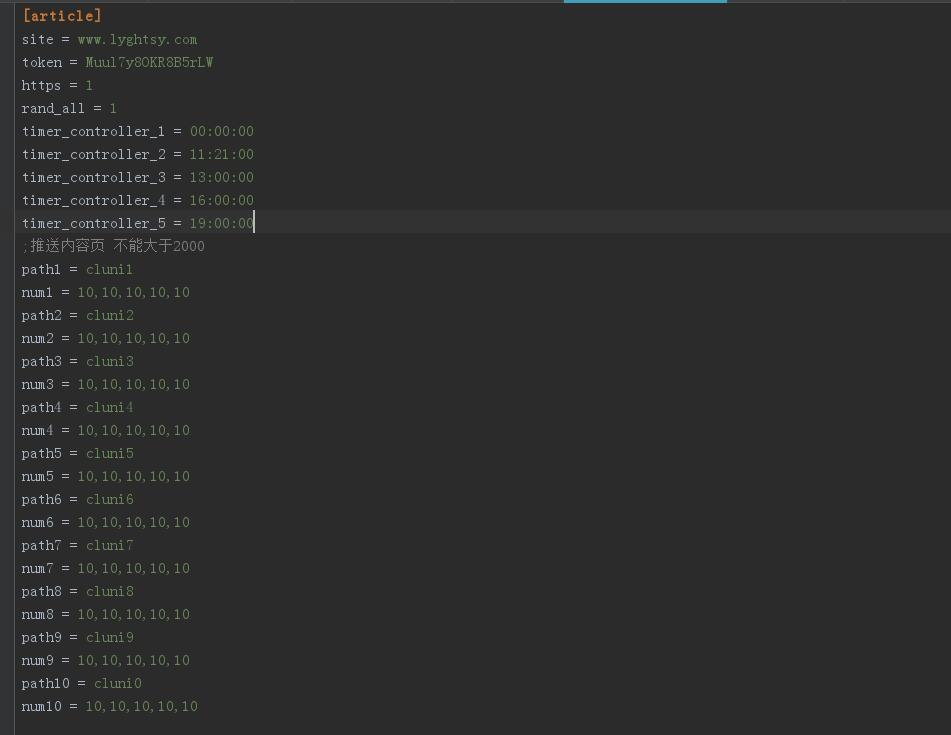
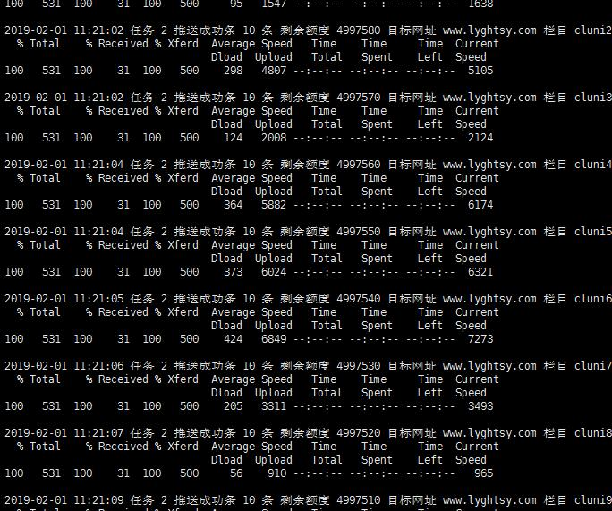

### 百度token通用随机URL自动推送程序v1.1

* 一个域名一个配置文件如 www.lyghtsy.com.ini
* <code>timer_controller_1</code> 到 <code>timer_controller_5</code> 配置推送时间 域名多的话请不要再同一个时间推送 服务器撑不住
* <code>path1</code>到<code>pathN</code> 配置推送目录 后面的数字分别对应三个推送时间段每个目录的推送数量 单次推送数量不能超过2000
* 程序运行后，增加删除配置文件不影响程序运行，可以直接修改配置文件。建议在本地修改好后上传到服务器
* 支持https
* 支持自动生成域名配置文件 create_config.py，设置域名在<code>model/domain.txt</code>
* 配置文件模型在<code>model/model.ini</code> 生成目录为<code>config_file</code> 请自行将配置文件转移到<code>config</code>目录下
* 随机自动生成推送时间
       
      # 此段代码位于 create_config.py 意思是替换配置模型 00:00:00 时间为随机3个小时内
      for config_line in file:
            push1_time = "00:00:00"
            push1_time_obj = datetime.datetime.strptime(push1_time, '%H:%M:%S')
            _push1 = (push1_time_obj + datetime.timedelta(seconds=randint(0, 7200))).strftime("%H:%M:%S")
            
            
### 成功示例

